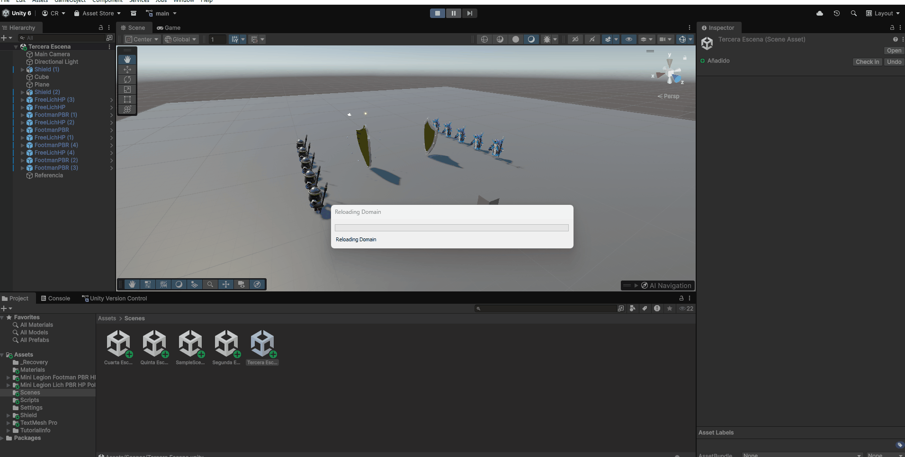

# Práctica 4 — Delegados y Eventos (Unity)

## Descripción general
En esta práctica se ha trabajado con **Unity** para implementar una serie de ejercicios orientados a comprender el funcionamiento de **colisiones, detección de eventos,
comunicación entre objetos, interacción con la UI y lógica de juego**.  
El objetivo final es crear un **prototipo interactivo** que combine movimiento, detección de colisiones, recolección de objetos y un sistema de puntuación con recompensas visuales.

---

## Ejercicio 1 — Detección de colisiones básicas
En este ejercicio se implementa la **colisión entre un cilindro y un cubo**, mostrando cómo detectar eventos `OnCollisionEnter` sin usar *Triggers*.  
Se utiliza un script de control que reacciona ante el impacto y envía mensajes a otros objetos.

**Demostración:**  

---

## Ejercicio 2 y 3 y 9 — Comunicación mediante mensajes y escudos con color
En este ejercicio, cambiamos las esferas por Prefabs de personajes de videojuegos, y hacemos que cuando el cubo toque un tipo de enemigo, el otro
tipo de enemigos, vaya hacia alguno de los escudos y al tocarlo cambia de color. Además, aqui figura el ejercicio 9 ya que desde un principio
se hicieorn estos ejercicios con el Cubo siendo un objeto físico.

**Demostración:**  

---

## Ejercicio 4 — Movimiento y orientación
Se desarrolla el movimiento de los humanoides y su orientación hacia un objetivo determinado en la escena.  
El script ajusta la rotación y el desplazamiento continuo para simular comportamiento autónomo.

**Demostración:**  

---

## Ejercicio 5 y 6 — Sistema de puntuación
Se implementa la lógica de **recolección de escudos** con distintas puntuaciones:  
- Escudo tipo 1 → +5 puntos  
- Escudo tipo 2 → +10 puntos  

Los puntos se muestran en consola al recolectar cada objeto.

**Demostración:**  

---

## Ejercicio 7 — Sistema de recompensas
Se amplía la mecánica de puntuación para que **cada 100 puntos** el jugador obtenga una **recompensa visual**, mostrada en la UI durante unos segundos.  
Esto simula logros o bonificaciones dentro del juego.

**Demostración:**  

---

## Ejercicio 8 — Escena final del prototipo
Se genera una **escena completa y funcional**, combinando todas las mecánicas anteriores:
- Movimiento del jugador  
- Recolección de escudos  
- Sistema de puntuación  
- Recompensas visuales  
- Interfaz integrada  

**Demostración:**  

---

## 🧑‍💻 Autor
**[Cristóbal Jesús Sarmiento Rodríguez]**  
Grado en Ingeniería Informática  
Asignatura: *Interfaces Inteligentes*  
Curso 2025/2026
